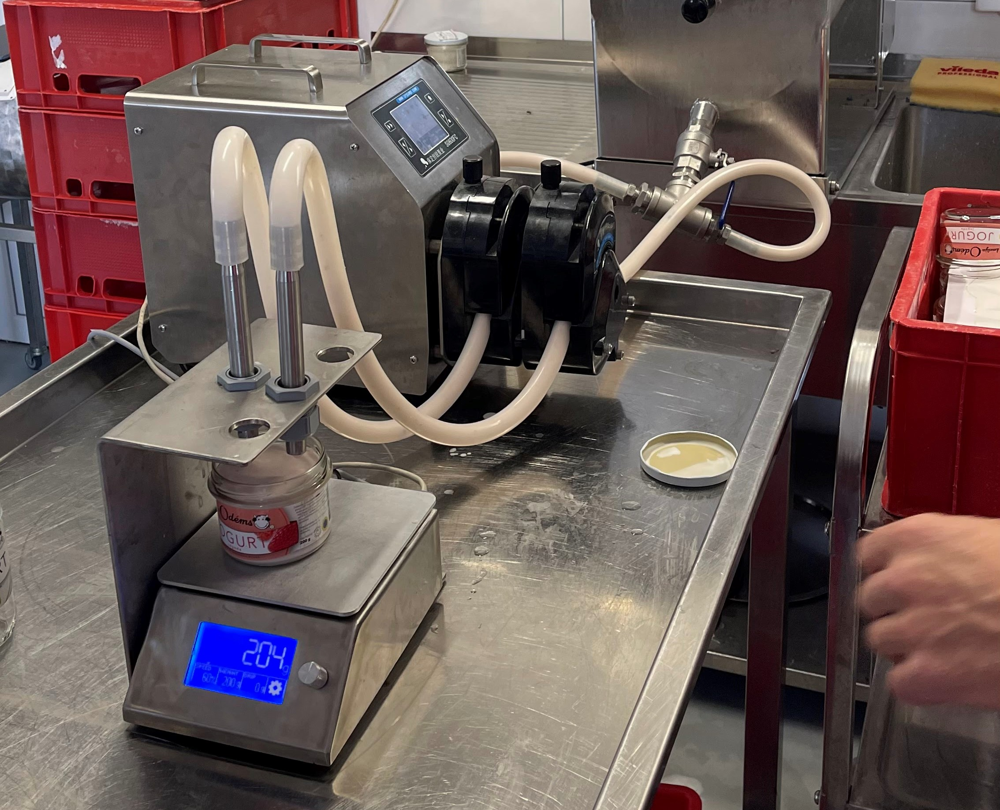
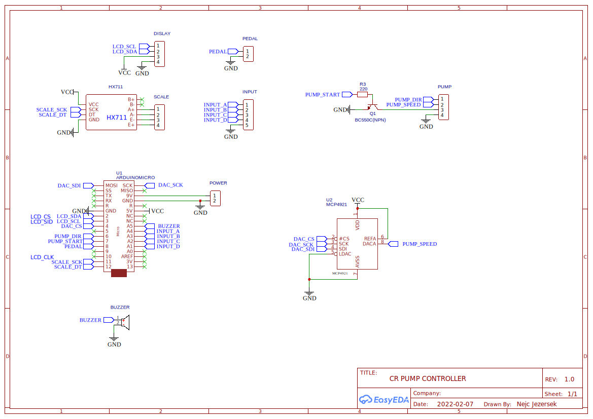

# CR-PUMP driver
This project tries to achieve accurate and repeatable filling of a given weight using a peristaltic pump. 

I was trying to fill yogurt into small cups. For this application, time-based control was not precise enough because the density of the yogurt and consequently the flow rate was not consistent enough. To get better accuracy I included a weight scale and a controller that adjusts the speed of the pump according to the weight of the yogurt in the cup.

This repository contains the code and the schematic for the controller.

The code works with the [SG600FC](https://www.crpump.com/a/Product/Touch_screen_Dispensing_Peristaltic_Pump/20170424/38.html) peristaltic pump from CR-pumps. Though not tested, it would probably work with other models because the external control interface appears to be very similar.

## Software
Arduino Micro is used as the controller. The code can be easely compiled and upladed using [Visual Studio Code](https://code.visualstudio.com/) with the [PlatformIO](https://platformio.org/) extension.

## Hardware
PCB was designed in EasyEDA. Here is the wiring diagram:

All PCB design files are also published [here](https://oshwlab.com/njezersek/cr-pump-driver).